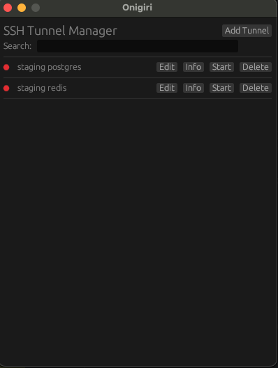

# Onigiri 🍙

A simple, GUI-based SSH tunnel manager for macOS.

> ⚠️ **Experimental Status**: This is currently an experimental project in active development. It works for basic SSH tunnel management but may have bugs or missing features. Use at your own risk in production environments.



## Features

- Create and manage multiple SSH tunnels through an intuitive GUI
- Start/stop tunnels with a single click
- Edit existing tunnel configurations
- Automatic tunnel cleanup on application exit
- Persistent storage of tunnel configurations
- Native macOS application

## Installation

### Requirements
- macOS (tested on Sonoma)
- SSH client installed and configured
- Rust toolchain (if building from source)

### Building from Source
```bash
# Clone the repository
git clone https://github.com/yourusername/onigiri.git
cd onigiri

# Build the application
cargo build --release

# Run the application
cargo run --release
```

## Usage

1. **Adding a New Tunnel**
   - Click the "+" button
   - Enter tunnel details:
     - Name: A friendly name for the tunnel
     - SSH Server: The SSH server to connect to
     - Local IP: Usually 127.0.0.1
     - Local Port: The port on your machine
     - Remote IP: The target service's IP/hostname
     - Remote Port: The target service's port

2. **Managing Tunnels**
   - Start/Stop: Click the toggle button
   - Edit: Click the edit button to modify settings
   - Delete: Click the delete button to remove a tunnel

3. **Application Data**
   - Configurations are stored in `~/Library/Application Support/Onigiri/ssh_tunnels.db`
   - Logs are written to stdout/stderr

## Development

### Project Structure
```
onigiri/
├── src/
│   └── main.rs          # Main application code
├── resources/
│   ├── icon.png         # Application icon
│   └── Onigiri.icns     # macOS icon file
├── Cargo.toml           # Dependencies and build configuration
└── README.md           # This file
```

### Building for Distribution
```bash
# Create a macOS application bundle
cargo build --release
```

## Known Issues

- This is an experimental project, expect rough edges and potential bugs
- Application is currently unsigned (requires manual security bypass)
- Only tested on macOS Sonoma
- Limited error handling in some edge cases
- No automatic updates
- Not recommended for critical production environments without thorough testing
- May have unexpected behavior with certain SSH configurations

## Contributing

Contributions are welcome! Please feel free to submit a Pull Request.

## License

This project is licensed under the MIT License - see the [LICENSE](LICENSE) file for details.

## Acknowledgments

- Built with [egui](https://github.com/emilk/egui) and [eframe](https://github.com/emilk/egui/tree/master/eframe)
- Uses [rusqlite](https://github.com/rusqlite/rusqlite) for data storage

